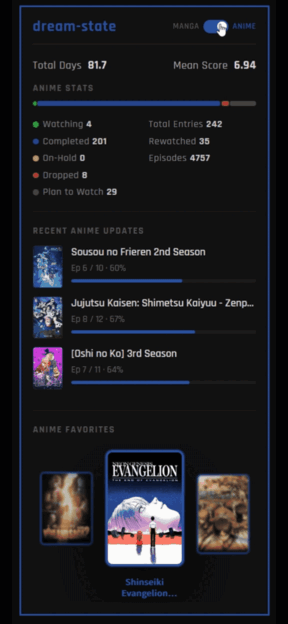

# MAL Widget Backend


A Cloudflare Worker that acts as a backend proxy for MyAnimeList data, designed to power embeddable MAL widgets. It combines MAL's own list endpoints (for real-time recent activity) with the Jikan API (for stats, profile, and favorites), giving you the best of both sources in a single fast response.



[Widget Project Link Here]

---

## Which version should I use?

Three versions are included — pick one, delete the others, and rename your chosen file to `index.js`.

| File | Health checks | Notifications | Extra setup |
|---|---|---|---|
| `index_trello.js` | ✅ Twice daily + manual trigger | Trello card | `TRELLO_KEY`, `TRELLO_TOKEN` |
| `index_discord.js` | ✅ Twice daily + manual trigger | Discord embed | `DISCORD_WEBHOOK` |
| `index_simple.js` | ❌ None | None | Nothing — just deploy |

If you just want something that works with minimal configuration, use `index_simple.js`.

---

## Why use this instead of just Jikan?

| Feature | This Backend | Jikan API only |
|---|---|---|
| Recent anime updates | ✅ Real-time from MAL list endpoint | ⚠️ Refreshes ~once per day |
| Recent manga updates | ✅ Real-time (list endpoint or profile scrape fallback) | ⚠️ Refreshes ~once per day |
| Statistics | ✅ Via Jikan | ✅ Via Jikan |
| Profile info | ✅ Via Jikan | ✅ Via Jikan |
| Favorites | ✅ Via Jikan | ✅ Via Jikan |
| Edge caching | ✅ Cloudflare CDN, 1 hour TTL | ❌ You handle it |
| Request coalescing | ✅ Concurrent requests share one upstream fetch | ❌ No |
| Rate limit handling | ✅ Graceful 503 with message | ⚠️ Raw upstream error |
| Cache invalidation | ✅ Per-user purge + version bump | ❌ No |
| Automated health checks | ✅ Twice daily via cron + alerts | ❌ No |
| CORS | ✅ Included | ⚠️ Depends on your setup |

The short version: Jikan's recent update data is cached on their end and can be up to 24 hours stale. This backend pulls recent anime and manga activity directly from MAL's list JSON endpoints, which reflect changes within minutes. Jikan is still used for everything it does well (stats, profile, favorites) since MAL has no public JSON API for those.

---

## API Response Structure

Fetch any user's data with a GET request:

```
GET https://your-worker.workers.dev/:username
```

### Full response shape

```json
{
  "username": "string",
  "profile": { ... },
  "statistics": {
    "anime": { ... },
    "manga": { ... }
  },
  "favorites": {
    "anime": [ ... ],
    "manga": [ ... ]
  },
  "recentUpdates": {
    "anime": [ ... ],
    "manga": [ ... ]
  },
  "timestamp": 1234567890000
}
```

### Field reference

<table>
  <thead>
    <tr>
      <th>Path</th>
      <th>Type</th>
      <th>Description</th>
      <th>Source</th>
    </tr>
  </thead>
  <tbody>
    <tr><td colspan="4"><strong>profile</strong></td></tr>
    <tr><td><code>profile.username</code></td><td>string</td><td>MAL username</td><td>Jikan</td></tr>
    <tr><td><code>profile.url</code></td><td>string</td><td>Full MAL profile URL</td><td>Jikan</td></tr>
    <tr><td><code>profile.image</code></td><td>string|null</td><td>Avatar image URL</td><td>Jikan</td></tr>
    <tr><td><code>profile.joined</code></td><td>ISO date</td><td>Account creation date</td><td>Jikan</td></tr>
    <tr><td><code>profile.last_online</code></td><td>ISO date</td><td>Last seen timestamp</td><td>Jikan</td></tr>
    <tr><td><code>profile.gender</code></td><td>string|null</td><td>Gender if set</td><td>Jikan</td></tr>
    <tr><td><code>profile.location</code></td><td>string|null</td><td>Location if set</td><td>Jikan</td></tr>
    <tr><td colspan="4"><strong>statistics.anime / statistics.manga</strong></td></tr>
    <tr><td><code>days_watched</code> / <code>days_read</code></td><td>number</td><td>Total days spent</td><td>Jikan</td></tr>
    <tr><td><code>mean_score</code></td><td>number</td><td>Average score</td><td>Jikan</td></tr>
    <tr><td><code>watching</code> / <code>reading</code></td><td>number</td><td>Currently active count</td><td>Jikan</td></tr>
    <tr><td><code>completed</code></td><td>number</td><td>Completed count</td><td>Jikan</td></tr>
    <tr><td><code>on_hold</code></td><td>number</td><td>On-hold count</td><td>Jikan</td></tr>
    <tr><td><code>dropped</code></td><td>number</td><td>Dropped count</td><td>Jikan</td></tr>
    <tr><td><code>plan_to_watch</code> / <code>plan_to_read</code></td><td>number</td><td>Plan to watch/read count</td><td>Jikan</td></tr>
    <tr><td><code>total_entries</code></td><td>number</td><td>Total list entries</td><td>Jikan</td></tr>
    <tr><td><code>rewatched</code> / <code>reread</code></td><td>number</td><td>Rewatch/reread count</td><td>Jikan</td></tr>
    <tr><td><code>episodes_watched</code></td><td>number</td><td>Total episodes watched</td><td>Jikan</td></tr>
    <tr><td><code>chapters_read</code></td><td>number</td><td>Total chapters read</td><td>Jikan</td></tr>
    <tr><td><code>volumes_read</code></td><td>number</td><td>Total volumes read</td><td>Jikan</td></tr>
    <tr><td colspan="4"><strong>recentUpdates.anime[] entries</strong></td></tr>
    <tr><td><code>mal_id</code></td><td>number</td><td>MAL anime ID</td><td>MAL list</td></tr>
    <tr><td><code>title</code></td><td>string|null</td><td>Anime title</td><td>MAL list</td></tr>
    <tr><td><code>url</code></td><td>string</td><td>MAL page URL</td><td>MAL list</td></tr>
    <tr><td><code>image</code></td><td>string|null</td><td>Cover image URL</td><td>MAL list</td></tr>
    <tr><td><code>progress</code></td><td>number</td><td>Episodes watched</td><td>MAL list</td></tr>
    <tr><td><code>total_episodes</code></td><td>number</td><td>Total episodes (0 = unknown)</td><td>MAL list</td></tr>
    <tr><td><code>score</code></td><td>number</td><td>User's score (0 = unscored)</td><td>MAL list</td></tr>
    <tr><td><code>updated_at</code></td><td>ISO date</td><td>Last activity timestamp</td><td>MAL list</td></tr>
    <tr><td><code>percentComplete</code></td><td>number</td><td>0–100 completion percentage</td><td>Computed</td></tr>
    <tr><td colspan="4"><strong>recentUpdates.manga[] entries</strong></td></tr>
    <tr><td><code>mal_id</code></td><td>number</td><td>MAL manga ID</td><td>MAL list / scrape</td></tr>
    <tr><td><code>title</code></td><td>string|null</td><td>Manga title</td><td>MAL list / scrape</td></tr>
    <tr><td><code>url</code></td><td>string</td><td>MAL page URL</td><td>MAL list / scrape</td></tr>
    <tr><td><code>image</code></td><td>string|null</td><td>Cover image URL</td><td>MAL list / scrape</td></tr>
    <tr><td><code>progress</code></td><td>number</td><td>Chapters read</td><td>MAL list / scrape</td></tr>
    <tr><td><code>total_chapters</code></td><td>number</td><td>Total chapters (0 = unknown)</td><td>MAL list / scrape</td></tr>
    <tr><td><code>score</code></td><td>number</td><td>User's score (0 = unscored)</td><td>MAL list only</td></tr>
    <tr><td><code>status</code></td><td>string|null</td><td>Reading, Completed, On-Hold, Dropped, Plan to Read</td><td>Scrape only</td></tr>
    <tr><td><code>updated_at</code></td><td>ISO date|null</td><td>Last activity timestamp</td><td>MAL list / scrape</td></tr>
    <tr><td><code>percentComplete</code></td><td>number</td><td>0–100, derived from total or MAL's graph bar width for unknown totals</td><td>Computed</td></tr>
    <tr><td colspan="4"><strong>favorites.anime[] / favorites.manga[] entries</strong></td></tr>
    <tr><td><code>mal_id</code></td><td>number</td><td>MAL ID</td><td>Jikan</td></tr>
    <tr><td><code>title</code></td><td>string</td><td>Title</td><td>Jikan</td></tr>
    <tr><td><code>url</code></td><td>string</td><td>MAL page URL</td><td>Jikan</td></tr>
    <tr><td><code>images</code></td><td>object</td><td>jpg + webp image URLs at multiple sizes</td><td>Jikan</td></tr>
    <tr><td><code>start_year</code></td><td>number</td><td>Year it started airing/publishing</td><td>Jikan</td></tr>
  </tbody>
</table>

---

## Utility Endpoints

| Endpoint | Description |
|---|---|
| `GET /health` | Returns `200 OK` — useful for uptime monitors |
| `GET /purge/:username` | Clears cached response for a specific user |
| `GET /debug-cache?username=` | Shows whether a user's response is currently cached |
| `GET /debug-profile/:username` | Shows raw MAL profile HTML around "Last Manga Updates" — useful for diagnosing scraper issues |
| `GET /health-check` | Manually triggers a health check and sends a report immediately *(Trello and Discord versions only)* |

### Cache invalidation

To immediately invalidate **all** cached responses across all users, bump the `CACHE_VERSION` variable in your `wrangler.toml` (e.g. change `1` to `2`) and redeploy. Every subsequent request will be treated as a cache miss.

> ⚠️ **Important:** Wrangler deploys wipe any env vars you set manually in the Cloudflare dashboard. To prevent this, define `CACHE_VERSION` in `wrangler.toml` under `[vars]` so it persists across deploys. Secrets (API keys, webhook URLs) should be set via `wrangler secret put` — those are stored securely in Cloudflare and survive deploys.

---

## How manga recent updates work

MAL's manga list JSON endpoint (`/mangalist/:username/load.json`) doesn't consistently expose a real `updated_at` timestamp — many accounts only have `created_at` (when the entry was first added), which is useless for showing recent activity.

The worker handles this with a two-stage approach:

1. **MAL list endpoint** — used first, sorted by `updated_at` if available
2. **Profile page scrape** — used as fallback if the list only has `created_at`, or if the list endpoint fails entirely. The worker scrapes the "Last Manga Updates" section from the public MAL profile page using browser-spoofed headers to avoid bot detection.

For manga with unknown total chapters (`?`), `percentComplete` is derived from the pixel width of MAL's own progress bar in the scraped HTML (max 190px = 100%), so progress always renders meaningfully even when totals aren't available.

---

## Setup

### Prerequisites

- [Node.js](https://nodejs.org/) (v18+)
- [Wrangler CLI](https://developers.cloudflare.com/workers/wrangler/) — `npm install -g wrangler`
- A free [Cloudflare account](https://dash.cloudflare.com/sign-up)

### 1. Clone the repo

```bash
git clone https://github.com/your-username/MAL-widget-backend.git
cd MAL-widget-backend
```

### 2. Choose your version

Pick one of the three worker files and rename it to `index.js`, or update the `main` field in `wrangler.toml` to point to it directly. Delete the others.

### 3. Log in to Cloudflare

```bash
wrangler login
```

This opens a browser window to authorize Wrangler with your Cloudflare account. Run `wrangler whoami` afterwards to confirm it worked.

### 4. Configure wrangler.toml

```toml
name = "your-worker-name"
main = "src/index.js"
compatibility_date = "2024-01-01"

[vars]
CACHE_VERSION = "1"

# Only needed for Trello and Discord versions, DELETE IF USING Simple:
[triggers]
crons = ["0 3 * * *", "0 15 * * *"]
```

### 5. Set secrets

Secrets are set via the Wrangler CLI so they're stored securely and never touch your codebase or git history. Run each command and paste the value when prompted.

**Trello version (`index_trello.js`):**
```bash
wrangler secret put TRELLO_KEY
wrangler secret put TRELLO_TOKEN
```
Get these from [https://trello.com/app-key](https://trello.com/app-key) — your API key is shown on that page, and there's a link to generate your token.

You also need to set the `LIST_ID` constant inside `runHealthCheck` in the code. To find your list ID, go to your Trello board URL and add `.json` to the end:
```
https://trello.com/b/xxxxxxxx/your-board-name.json
```
Open that in your browser, then Ctrl+F for `"lists"` — you'll see an array of list objects, each with an `"id"` field. Copy the `"id"` of whichever list you want cards posted to and paste it into the `LIST_ID` value in the code.

**Discord version (`index_discord.js`):**
```bash
wrangler secret put DISCORD_WEBHOOK
```
Create a webhook in your server under **Server Settings → Integrations → Webhooks → New Webhook**, then copy the URL.

**Simple version (`index_simple.js`):**

No secrets needed — skip this step entirely.

### 6. Deploy

```bash
wrangler deploy
```

You'll see output confirming your Worker URL and, for the Trello/Discord versions, both cron schedules. Test it by visiting:

```
https://your-worker.workers.dev/Seqsy
```

You should get a full JSON response with profile, stats, favorites, and recent updates.

---

## Automated health checks

*(Trello and Discord versions only)*

The worker runs a health check twice daily (6 AM and 6 PM CST) that fetches live data for a known active test user directly from MAL and checks for common failure signatures:

- Anime and manga update arrays are non-empty
- All entries have non-null titles and images
- No title looks like a raw URL slug (a sign the scraper fell back to broken state)
- At least one manga entry has progress > 0

A report is sent regardless of outcome — ✅ green if all clear, 🚨 red listing specific issues if something's wrong.

**Trigger a report manually at any time:**
```
GET https://your-worker.workers.dev/health-check
```

**To change the test username**, find `const TEST_USER = "Seqsy"` inside `runHealthCheck` and replace it with any MAL user who reads manga actively. The more active the better — it makes failures easier to catch.

---

## Local development

```bash
wrangler dev
```

This runs the worker locally at `http://localhost:8787`. Note that Cloudflare-specific features like `cf.cacheTtl` are simulated, so caching behavior may differ slightly from production.

---

## License

MIT


